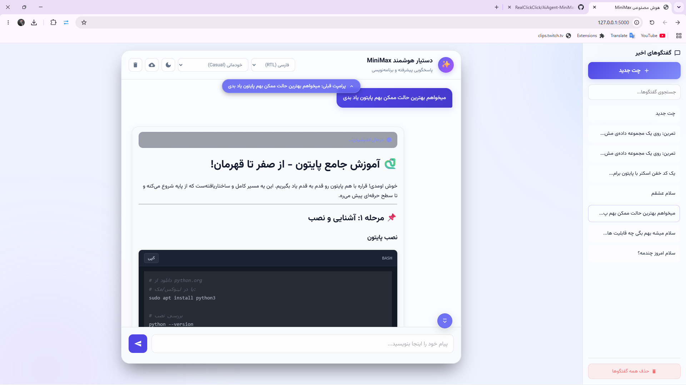
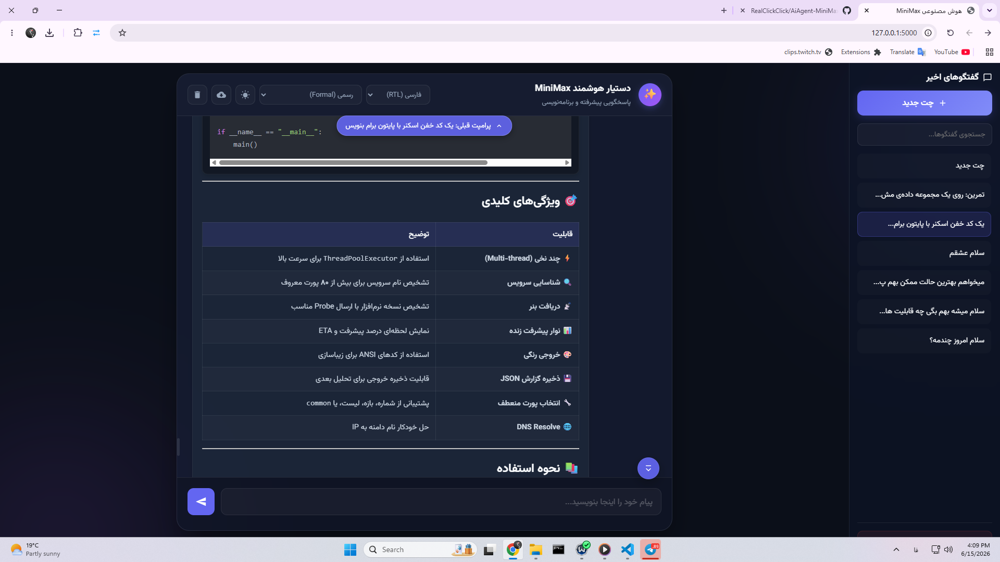

# دستیار هوشمند MiniMax (MiniMax AI Chatbot)

Bilingual Setup and Features Guide / راهنمای دوزبانه راه‌اندازی و قابلیت‌ها

---

## Preview / نمای محیط نرم‌افزار

### Light Mode / حالت روز


### Dark Mode / حالت شب


---

## 🇮🇷 راهنمای فارسی (Persian Guide)

یک چت‌بات هوش مصنوعی پیشرفته و مدرن با رابط کاربری شیک (Glassmorphism)، انیمیشن‌های پویا، مدیریت گفتگوها و شخصی‌سازی پیشرفته پاسخ‌ها.

### 🚀 ویژگی‌ها و قابلیت‌های کلیدی
۱. **انتخابگر لحن پیشرفته:** پشتیبانی از ۹ لحن پاسخگویی مختلف (خودمانی، رسمی، خلاق، مختصر، طعنه‌آمیز، بی‌احساس/رباتیک، سرگرم‌کننده/فان، بی‌ادبانه، و عاشقانه) با به‌روزرسانی پویای دستور سیستم.
۲. **بومی‌سازی کامل و چرخش جهت صفحه (RTL/LTR Layout Flip):** پشتیبانی کامل از زبان‌های فارسی و انگلیسی. تغییر جهت چیدمان، سایدبار و دکمه‌ها متناسب با زبان.
۳. **مدیریت پیشرفته گفتگوها:** امکان ذخیره و بازیابی چت‌ها در مرورگر (`localStorage`)، خروجی گرفتن به صورت فایل JSON و غیرفعال‌سازی هوشمند دکمه‌ها در چت خالی.
۴. **رابط کاربری مدرن تعاملی:** طراحی واکنش‌گرا برای موبایل، پالس آواتار، کادر متنی هوشمند، تگ‌های پیشنهاد پرامپت تعاملی، هایلایت کدهای برنامه‌نویسی با دکمه کپی، و امکان ویرایش و تلاش مجدد پیام‌ها.

### 🖥️ محیط نرم‌افزار
محیط برنامه به صورت یک داشبورد چت مدرن طراحی شده و برای استفاده روزمره در مرورگر بهینه است:

- **پنل اصلی چت:** نمایش پیام‌های کاربر و پاسخ‌های هوش مصنوعی با پشتیبانی از Markdown، کدهایلایت، جدول، لیست و متن‌های راست‌چین/چپ‌چین.
- **سایدبار گفتگوها:** دسترسی سریع به گفتگوهای اخیر، ساخت چت جدید، جستجوی گفتگوها و حذف همه چت‌ها.
- **حالت روز و شب:** امکان تغییر سریع بین ظاهر روشن و تاریک؛ انتخاب کاربر در مرورگر ذخیره می‌شود.
- **کنترل زبان و لحن:** انتخاب زبان پاسخگویی فارسی، انگلیسی یا خودکار و انتخاب لحن پاسخ از نوار بالای چت.
- **ناوبری پیام‌ها:** دکمه شناور برای برگشت به پرامپت‌های قبلی و دکمه رفتن به پایین چت هنگام اسکرول در گفتگوهای طولانی.
- **ورودی پیام:** کادر نوشتن پیام با تغییر ارتفاع خودکار، دکمه ارسال/توقف تولید پاسخ و پشتیبانی از تاریخچه پرامپت‌ها.

### 🔑 تنظیمات کلید API (TokenRouter)
برای استفاده از این پروژه نیاز به کلید API دارید. سرویس‌دهنده مرجع برای دریافت کلید:
👉 **[TokenRouter (https://www.tokenrouter.com)](https://www.tokenrouter.com/)**

جهت تنظیم کلید، مقدار `api_key` را در خط ۹ فایل [app.py](file:///d:/Projects/AiAgent/app.py) ویرایش کنید:
```python
client = OpenAI(
    base_url='https://api.tokenrouter.com/v1',
    api_key='کلید_شما_در_اینجا',
)
```

### 💻 راهنمای نصب و اجرا
۱. ایجاد محیط مجازی:
   ```bash
   python -m venv .venv
   ```
۲. فعال‌سازی محیط مجازی:
   - ویندوز: `.venv\Scripts\activate`
   - مک/لینوکس: `source .venv/bin/activate`
۳. نصب وابستگی‌ها:
   ```bash
   pip install -r requirements.txt
   ```
۴. اجرای برنامه:
   ```bash
   python app.py
   ```
۵. باز کردن مرورگر و رفتن به آدرس: **[http://127.0.0.1:5000](http://127.0.0.1:5000)**

---

## 🇬🇧 English Guide

An advanced and modern AI chatbot featuring a sleek glassmorphic user interface, dynamic animations, session management, and highly customizable response styles.

### 🚀 Key Features
1. **Advanced Tone Selector:** Supports 9 response tones (Casual/Friendly, Formal, Creative, Concise, Sarcastic, Robotic, Fun, Rude, and Romantic) with real-time prompt generation.
2. **Full Localization & LTR/RTL Layout Flip:** Supports Persian and English. Automatically shifts the sidebar, layout direction, and action button directions depending on the chat language.
3. **Session Management:** Saves chats to browser `localStorage`, allows exporting chat history to JSON, and intelligently disables action buttons for empty conversations.
4. **Interactive Glassmorphism UI:** Responsive layout, glowing pulsing avatar, auto-resizing text input, interactive prompt suggestion tags, syntax highlighting with copy buttons, and message editing/regeneration.

### 🖥️ Application Interface
The app is designed as a modern browser-based chat dashboard:

- **Main chat panel:** Displays user messages and AI responses with Markdown rendering, syntax highlighting, tables, lists, and RTL/LTR text support.
- **Conversation sidebar:** Provides recent chats, new chat creation, chat search, active chat highlighting, and bulk deletion.
- **Light and dark modes:** Users can switch between bright and dark themes, with the selected theme saved in the browser.
- **Language and tone controls:** The top toolbar lets users choose Persian, English, or automatic language mode, plus a custom response tone.
- **Message navigation:** Floating controls help users jump back to previous prompts or return to the bottom of long conversations.
- **Message composer:** Includes auto-resizing input, send/stop behavior, and prompt history support.

### 🔑 API Key Configuration (TokenRouter)
An API key is required to use this chatbot. Get your API key from the reference provider:
👉 **[TokenRouter (https://www.tokenrouter.com)](https://www.tokenrouter.com/)**

To configure the key, edit the `api_key` string on line 9 of `app.py`:
```python
client = OpenAI(
    base_url='https://api.tokenrouter.com/v1',
    api_key='your_api_key_here',
)
```

### 💻 Quick Start & Installation
1. Create a virtual environment:
   ```bash
   python -m venv .venv
   ```
2. Activate the virtual environment:
   - Windows: `.venv\Scripts\activate`
   - macOS / Linux: `source .venv/bin/activate`
3. Install the dependencies:
   ```bash
   pip install -r requirements.txt
   ```
4. Run the Flask application:
   ```bash
   python app.py
   ```
5. Open your browser and navigate to: **[http://127.0.0.1:5000](http://127.0.0.1:5000)**
